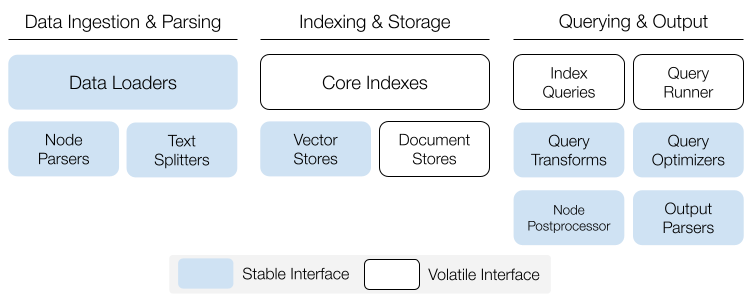

# 💡 Contributing to LlamaIndex

> ⚠️ **NOTE**: We are rebranding GPT Index as LlamaIndex! 
> **2/19/2023**: We are still in the middle of the transition. If you are interested in contributing to LlamaIndex, make sure to follow the below steps. For testing, please do `import gpt_index` instead of `import llama_index`.

Interested in contributing to LlamaIndex? Here's how to get started! 

## Contribution Guideline
The best part of LlamaIndex is our community of users and contributors.
We are actively working on making our codebase more modular and extensible.


### What should I work on?
- 🆕 Extend core modules
- 📄 Improve code quality & documentation
- 🐛 Fix bugs
- 🎉 Add usage examples
- 🧪 Add experimental features 

Also, join our Discord for discussions: https://discord.gg/dGcwcsnxhU.


### 🆕 Extend Core Modules


#### Data Loaders
Our goal is to be able to load data of any format, from anywhere.

Contributing a data loader is easy and super impactful for the community.
The preferred way to contribute is making a PR at [LlamaHub Github](https://github.com/emptycrown/llama-hub).


Examples:
* [Google Sheets Loader](https://github.com/emptycrown/llama-hub/tree/main/loader_hub/google_sheets)
* [Gmail Loader](https://github.com/emptycrown/llama-hub/tree/main/loader_hub/gmail)
* [Github Repository Loader](https://github.com/emptycrown/llama-hub/tree/main/loader_hub/github_repo)

#### Vector Stores

Examples:
* [Pinecone](https://github.com/jerryjliu/llama_index/blob/main/gpt_index/vector_stores/pinecone.py)
* [Faiss](https://github.com/jerryjliu/llama_index/blob/main/gpt_index/vector_stores/faiss.py)
* [Chroma](https://github.com/jerryjliu/llama_index/blob/main/gpt_index/vector_stores/chroma.py)
#### Text Splitters
#### Vector Stores
#### Query Transforms
#### Query Optimizers
#### Node Postprocessors
#### Output Parsers

### Add Examples
### Improve Code Quality & Documentation
### Fix Bugs
All future tasks are tracked in [Github Issues Page](https://github.com/jerryjliu/gpt_index/issues).
Please feel free to open an issue and/or assign an issue to yourself.

## Development Guideline
### Environment Setup

LlamaIndex is a Python package. We've tested primarily with Python versions >= 3.8. Here's a quick
and dirty guide to getting your environment setup.

First, create a fork of LlamaIndex, by clicking the "Fork" button on the [LlamaIndex Github page](https://github.com/jerryjliu/gpt_index).
Following [these steps](https://docs.github.com/en/get-started/quickstart/fork-a-repo) for more details
on how to fork the repo and clone the forked repo.

Then, create a new Python virtual environment. The command below creates an environment in `.venv`,
and activates it:
```bash
python -m venv .venv
source .venv/bin/activate
```

Install the required dependencies (this will also install gpt-index through `pip install -e .` 
so that you can start developing on it):

```bash
pip install -r requirements.txt
```

Now you should be set! 


### Validating your Change

Let's make sure to `format/lint` our change. For bigger changes,
let's also make sure to `test` it and perhaps create an `example notebook`.

#### Formatting/Linting

You can format and lint your changes with the following commands in the root directory:

```bash
make format; make lint
```

You can also make use of our pre-commit hooks by setting up git hook scripts:

```bash
pre-commit install
```

We run an assortment of linters: `black`, `ruff`, `mypy`.

#### Testing

For bigger changes, you'll want to create a unit test. Our tests are in the `tests` folder.
We use `pytest` for unit testing. To run all unit tests, run the following in the root dir:

```bash
pytest tests
```

### Creating an Example Notebook

For changes that involve entirely new features, it may be worth adding an example Jupyter notebook to showcase
this feature. 

Example notebooks can be found in this folder: https://github.com/jerryjliu/gpt_index/tree/main/examples.


### Creating a pull request

See [these instructions](https://docs.github.com/en/pull-requests/collaborating-with-pull-requests/proposing-changes-to-your-work-with-pull-requests/creating-a-pull-request-from-a-fork)
to open a pull request against the main LlamaIndex repo.


