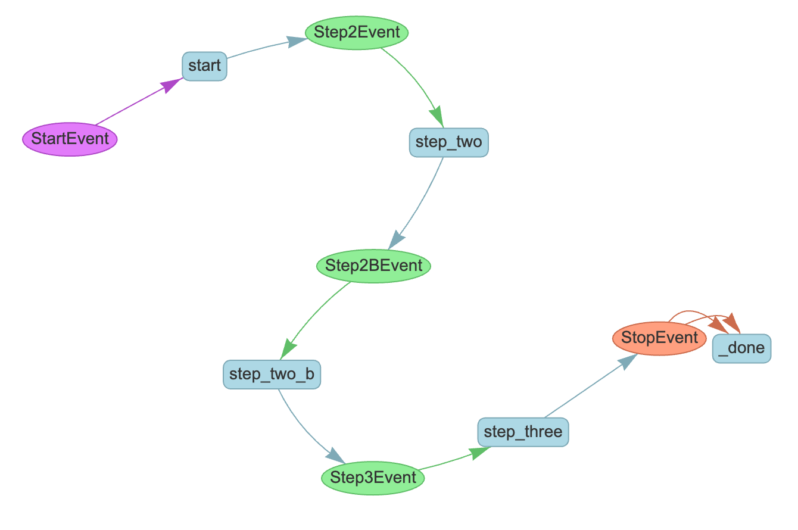

# Extending workflows

Another great feature of workflows is their extensibility. You can take workflows written by others or built-ins from LlamaIndex and extend them to customize them to your needs. Let's look at two ways to do that.

## Subclassing workflows

Workflows are just regular Python classes, which means you can subclass them to add new functionality. For example, let's say you have an agentic workflow that does some processing and then sends an email. You can subclass the workflow to add an extra step to send a text message as well.

Here's our base workflow:

```python
from llama_index.core.workflow import (
    StartEvent,
    StopEvent,
    Workflow,
    step,
    Event,
    Context,
)


class Step2Event(Event):
    query: str


class Step3Event(Event):
    query: str


class MainWorkflow(Workflow):
    @step()
    async def start(self, ev: StartEvent) -> Step2Event:
        print("Starting up")
        return Step2Event(query=ev.query)

    @step()
    async def step_two(self, ev: Step2Event) -> Step3Event:
        print("Sending an email")
        return Step3Event(query=ev.query)

    @step()
    async def step_three(self, ev: Step3Event) -> StopEvent:
        print("Finishing up")
        return StopEvent(result=ev.query)
```

If we run this:

```python
w = MainWorkflow(timeout=10, verbose=False)
result = await w.run(query="Initial query")
print(result)
```

We get:

```
Starting up
Sending an email
Finishing up
Initial query
```

Now let's subclass this workflow to send a text message as well:

```python
class Step2BEvent(Event):
    query: str


class CustomWorkflow(MainWorkflow):
    @step()
    async def step_two(self, ev: Step2Event) -> Step2BEvent:
        print("Sending an email")
        return Step2BEvent(query=ev.query)

    @step()
    async def step_two_b(self, ev: Step2BEvent) -> Step3Event:
        print("Also sending a text message")
        return Step3Event(query=ev.query)
```

Which will instead give us

```
Starting up
Sending an email
Also sending a text message
Finishing up
Initial query
```

We can visualize the subclassed workflow and it will show all the steps, like this:

```python
draw_all_possible_flows(CustomWorkflow, "custom_workflow.html")
```



## Adding service flows

Another way to extend workflows is to add service flows. These are explicit slots in existing flows where the author is expecting you to supply a custom flow. For example, let's say we had a query that used an LLM to reflect on the quality of that query. The author might expect that you would want to modify the reflection step, and leave a slot for you to do that.

Here's our base workflow:

```python
from llama_index.core.workflow import (
    StartEvent,
    StopEvent,
    Workflow,
    step,
    Event,
    Context,
)
from llama_index.utils.workflow import draw_all_possible_flows


class Step2Event(Event):
    query: str


class MainWorkflow(Workflow):
    @step()
    async def start(
        self, ctx: Context, ev: StartEvent, reflection_workflow: Workflow
    ) -> Step2Event:
        print("Need to run reflection")
        res = await reflection_workflow.run(query=ev.query)

        return Step2Event(query=res)

    @step()
    async def step_two(self, ctx: Context, ev: Step2Event) -> StopEvent:
        print("Query is ", ev.query)
        # do something with the query here
        return StopEvent(result=ev.query)
```

This workflow by itself will not run; it needs a valid workflow for the reflection step. Let's create one:

```python
class CustomSubflow(Workflow):
    @step()
    async def sub_start(self, ctx: Context, ev: StartEvent) -> StopEvent:
        print("Doing custom reflection")
        return StopEvent(result="Improved query")
```

Now we can run the main workflow by supplying this custom reflection service flow using the `add_services` method:

```python
w = MainWorkflow(timeout=10, verbose=False)
w.add_services(reflection_workflow=CustomSubflow())
result = await w.run(query="Initial query")
print(result)
```

Note that because the sub-flow is a totally different workflow rather than a step, `draw_all_possible_flows` will only draw the flow of `MainWorkflow`.

Finally, let's take a look at [observability and debugging](observability.md) in workflows.
